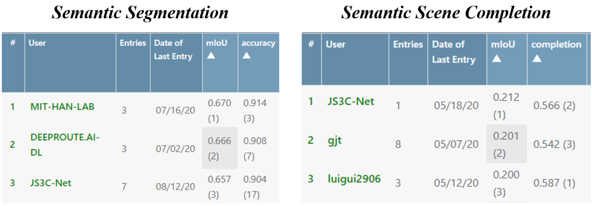

# JS3C-Net
### Sparse Single Sweep LiDAR Point Cloud Segmentation via Learning Contextual Shape Priors from Scene Completion (AAAI2021)
 
This repository is for **JS3C-Net** introduced in the following **AAAI-2021** paper [[arxiv paper]](https://arxiv.org/abs/2012.03762)

Xu Yan, Jiantao Gao, Jie Li, Ruimao Zhang, [Zhen Li*](https://mypage.cuhk.edu.cn/academics/lizhen/), Rui Huang and Shuguang Cui, "Sparse Single Sweep LiDAR Point Cloud Segmentation via Learning Contextual Shape Priors from Scene Completion".

* Semantic Segmentation and Semantic Scene Completion:


If you find our work useful in your research, please consider citing:
```
@InProceedings{yan2021sparse,
  title={Sparse Single Sweep LiDAR Point Cloud Segmentation via Learning Contextual Shape Priors from Scene Completion},
  author={Yan, Xu and Gao, Jiantao and Li, Jie and Zhang, Ruimao, and Li, Zhen and Huang, Rui and Cui, Shuguang},
  journal={AAAI Conference on Artificial Intelligence ({AAAI})},
  year={2021}
}
```

## Getting Started

### Set up
Clone the repository:
```
git clone https://github.com/yanx27/JS3C-Net.git
```

Installation instructions for Ubuntu 16.04:
     
* Make sure <a href="https://docs.nvidia.com/cuda/cuda-installation-guide-linux/index.html">CUDA</a>  and <a href="https://docs.nvidia.com/deeplearning/sdk/cudnn-install/index.html">cuDNN</a> are installed. Only this configurations has been tested: 
     - Python 3.6.9, Pytorch 1.3.1, CUDA 10.1;
* Compile the customized operators by `sh complile.sh` in `/lib`. 
* Install [spconv1.0](https://github.com/traveller59/spconv)  in `/lib/spconv`. We use the same version with [PointGroup](https://github.com/Jia-Research-Lab/PointGroup), you can install it according to the instruction. Higher version spconv may cause issues.


### Data Preparation
* SemanticKITTI and SemanticPOSS datasets can be found in [semantickitti-page](http://semantic-kitti.org/dataset.html#download) and [semanticposs-page](http://www.poss.pku.edu.cn/semanticposs.html). 
* Download the files related to **semantic segmentation** and extract everything into the same folder. 
* Use [voxelizer](https://github.com/jbehley/voxelizer) generate ground truths of **semantic scene completion**, where following parameters are used. We provide pre-processed SemanticPOSS SSC labels [here](https://drive.google.com/file/d/1O2Tg-r5egVPLNboRwd321sobJvgmFUvI/view?usp=sharing).
```angular2
min range: 2.5
max range: 70
future scans: 70
min extent: [0, -25.6, -2]
max extent: [51.2, 25.6,  4.4]
voxel size: 0.2
```

* Finally, the dataset folder should be organized as follows.
```angular2
SemanticKITTI(POSS)
├── dataset
│   ├── sequences
│   │  ├── 00
│   │  │  ├── labels
│   │  │  ├── velodyne
│   │  │  ├── voxels
│   │  │  ├── [OTHER FILES OR FOLDERS]
│   │  ├── 01
│   │  ├── ... ...

```
* Note that the data for official SemanticKITTI SSC benchmark only contains 1/5 of the whole sequence.

### SemanticKITTI
#### Training
Run the following command to start the training. Output (logs) will be redirected to `./logs/JS3C-Net-kitti/`.  You can ignore this step if you want to use our pretrained model in `./logs/JS3C-Net-kitti/`.
```angular2
$ python train.py --gpu 0 --log_dir JS3C-Net-kitti --config opt/JS3C_default_kitti.yaml
```
#### Evaluation Semantic Segmentation
Run the following command to evaluate model on evaluation or test dataset
```
$ python test_kitti_segment.py --log_dir JS3C-Net-kitti --gpu 0 --dataset [val/test]
```

#### Evaluation Semantic Scene Completion
Run the following command to evaluate model on evaluation or test dataset
```
$ python test_kitti_ssc.py --log_dir JS3C-Net-kitti --gpu 0 --dataset [val/test]
```

### SemanticPOSS
Results on SemanticPOSS can be easily obtained by
```angular2
$ python train.py --gpu 0 --log_dir JS3C-Net-POSS --config opt/JS3C_default_POSS.yaml
$ python test_poss_segment.py --gpu 0 --log_dir JS3C-Net-POSS
```

## Pretrained Model
We trained our model on a single Nvidia Tesla V100 GPU with batch size 6. If you want to train on the TITAN GPU, you can choose batch size as 2.

| Model | #Param | Segmentation | Completion | Checkpoint |
|--|--|--|--|--|
|JS3C-Net| 2.69M | 66.0 | 56.6 | [18.5MB](log/JS3C-Net-kitti) |

## Results on SemanticKITTI Benchmark
Quantitative results on **SemanticKITTI Benchmark** at the submisison time.


## Acknowledgement
This project is not possible without multiple great opensourced codebases. 
* [SparseConv](https://github.com/facebookresearch/SparseConvNet)
* [spconv](https://github.com/traveller59/spconv)
* [PointGroup](https://github.com/Jia-Research-Lab/PointGroup)
* [nanoflann](https://github.com/jlblancoc/nanoflann)
* [semantic-kitti-api](https://github.com/PRBonn/semantic-kitti-api)
## License
This repository is released under MIT License (see LICENSE file for details).
